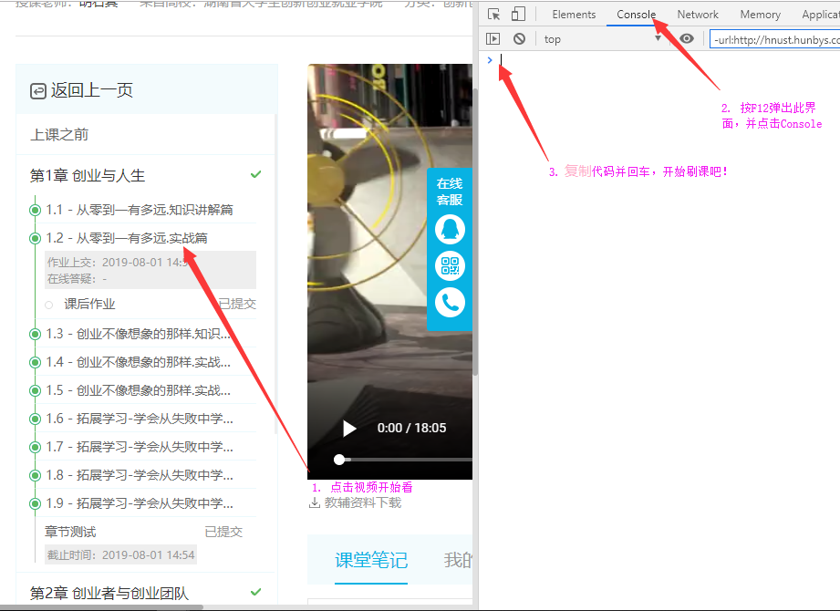
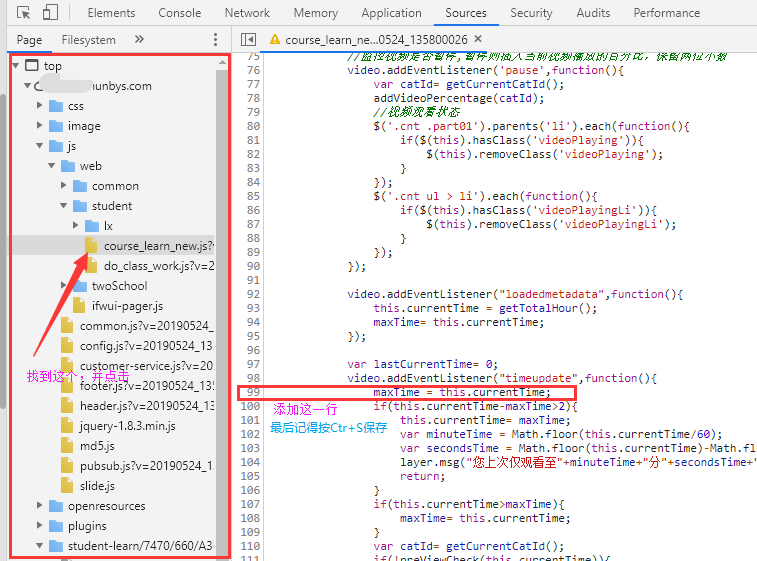
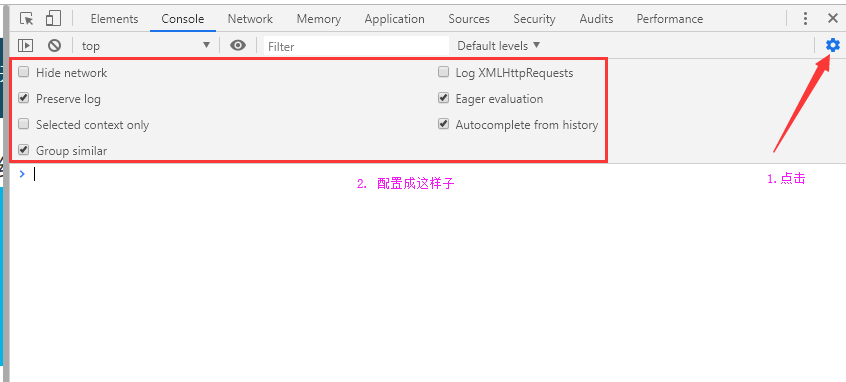

# OnlineMoocCourse-Auto-Watcher

> <b>有同学给我提建议，有的学校的部分章节的部分课是有选修部分的，然而我的学校并没有选修部分，他想跳过选修部分。但是我的账号不能够进行软件分析/设计。所以如果哪位同学想贡献你的账号给我测试，这个账号的课程应该包含选修部分的课，可以邮箱联系我canliture@outlook.com。</b>


- **2019.6.6 增加Java程序辅助挂机，手动的地方只有3~5分钟**

[TOC]

## 说明

按理来说，网站后缀为**hunbys.com** 的网课，都能按照这个方法来刷。这里**仅仅以湖南创业网课** 为一个刷网课例子。


## 1. 提示：

- **本软件禁止用于商业用途**
- **本软件仅仅用于学习交流使用，禁止用于不合理的学习之用**
- **本软件使用过程中导致的任何账号异常，学校处分，作者不会承担责任，所以请谨慎使用**
- **本软件仍然有很多可以改进的地方，所以如果您对代码有更多的优化，可以尝试在issus中提出来哦，当然，您也能够发邮箱canliture@outlook.com给我**

- **最后，觉得我的内容不错，可以`Star一下呗！`或者请我喝奶茶，激励我创造更好的内容？哈哈。。**


## 2. 刷视频

首先，这里拿**湖南创业网课以一个例子，前面说过hunbys.com域名下的网站都能够使用此方法。**


首先课程占比为**视频看完占30%，章节测试占30%，课后习题占10%**。

**根据测试，视频刷完，然后保证章节测试质量的情况下，课后习题由于占分不大，可以随意填写。**


24小时的课程刷完确实挺头疼的。**鼠标不能够移除界面** ，**中途还有随堂测试弹出来**，难道只能乖乖认真地看完？

Not Really!!

### 

下面给出代码。

注意第一行的代码```var rate = 2;```，根据实际情况，你可以**将2改成你想要的播放倍速** ，不过最好速率不要太高，否则，很可能会被系统检测出来，到时候就白白得挂机了。

代码功能如下

- ***鼠标能够移动到界面外，方便挂机***

- ***默认，播放倍速为2***
- ***默认，是没有声音的，还是为了方便挂机***

```javascript
var rate = 2;
layer.open({
    type: 1,//info
    title: "<b style='color:red'>温馨提示</b>",
    area: ["560", "500"],  
    shade: 0.5,
	closeBtn: 0,
    content: "<div id=\"canliture@outlook.com\"class=\"canliture@outlook.com\"style=\"line-height: 30px; margin: 20px\"><ul><li><b>一丶本软件仅供软件源码学习交流使用</b><ul style=\"text-indent: 2em;\"><li>1.请勿用于不正当学习途径使用</li><li>2.请勿用于商业用途</li></ul></li><li><b>二丶研究过程中有任何问题，下面有联系方式</b><ul style=\"text-indent: 2em;\"><li>1.发邮件:canliture@outlook.com</li><li>2.加QQ:1264633834</li><li>3.关注代码最新更新:<a style=\"color:red\" href=\"https://github.com/canliture/OnlineMoocCourse-Auto-Watcher\">点击查看OnlineMoocCourse-Auto-Watcher代码</a></li></ul></li><li><b>三丶联系我的目的仅为学习交流，让我更好的优化代码</b></li></ul></div>",//支持获取DOM元素
    btn: [ "确定/同意 并开始使用" ], //按钮组
	offset:($('body')[0].clientHeight-600)/2+"px",
    yes: function(index){
        layer.close(index);
      
clearInterval(interval);
var interval = setInterval(function(){
	layer.closeAll();
	video.volume = 0;
	video.playbackRate = rate;
	if(video.duration - video.currentTime < 10){
		var next = document.getElementsByClassName("pull-right")[0]
			    || $("a[canbelearn=true]").last();
		console.log(next);
		next.click();
	}video.play();}, 1000);},});
```

### 2.2 运行代码和一些注意事项

软件很可能运行中途会由于网络或者系统问题，会停下来。没关系，刷新一下，再次运行代码即可。一般出现这种情况的时候不多。


**怎么运行代码？**




另外，**当你的播放速率过大的时候，你很可能需要如下设置，注意，很可能你的学校的跟我学校的方法不一样，此时你可以再issue里面提出来，我们会争取在这里列出更多学校的操作指南。**



## 3. 刷题目

仍然是湖南创业网课，这里给出代码。答案我们已经在博客[湖南《创业基础》网课—— 参考答案](https://blog.csdn.net/qq_37206105/article/details/90081419)  一文中给出来了。这里只讨论代码了。


前面说过，课后习题不占什么分数，并且课后习题有100多个，所以手动填太麻烦了。课后习题我们说过，随便填，那么我们就用代码随便填吧：我们统一 **对单选题/判断题选第一个，多选题选第1，2个，填空题填创业两字+某个数字** 

```javascript
(function(){
	// 对选择题/判断题进行选择
	var radios = document.getElementsByClassName("radioAndValue");
	for(var i = 0 ; i < radios.length ; i++){
		var parentNode = radios[i].parentNode;
		parentNode.getElementsByTagName("i")[0].click();
	}

	// 对多选题进行选择
	var checkboxs = document.getElementsByClassName("bg checkbox");
	for(var i = 0 ; i < checkboxs.length ; i++){
		var j = (i+1)%4;
		if( j == 1 || j == 2 ) {
			checkboxs[i].click();
		}
	}

	// 对填空题进行填空
	var cardText = document.getElementsByClassName("text cardText");
	for(var i = 0 ; i < cardText.length ; i++){
		cardText[i].setAttribute("value", "创业" + (i+1));
	}
	// 对简答题进行选择
	var textArea = document.getElementsByClassName("cardTextArea");
	for(var i = 0 ; i < textArea.length ; i++){
		textArea[i].focus();
		textArea[i].innerHTML = "创业" + (i+1);
	}
	
	// 提交
	$("#submitBtn").click(); 
	
	setInterval(function(){
		$(".layui-layer-btn0").click(); // 确定/关闭
	}, 10);
})();
```

如果你不确定答案的话，你可以把**后面的这几行代码删除，看看运行之后的效果：** 

```javascript
// 提交
$("#submitBtn").click(); 

setInterval(function(){
  $(".layui-layer-btn0").click(); // 确定/关闭
}, 10);
```
如果确定没啥问题了，我们就直接运行上面的完整代码吧。它能够**直接提交答案，并且关闭窗口** 


__添加一些简单的操作：将下面的代码复制到看视频的页面的控制台下，回车使其生效。此时，我们就能够按一下回车就打开一节课后作业的页面。所以现在我们要做的操作就是：回车+F12+(Ctr+v粘贴)+回车 + ....(循环往复...)__

__需要注意的是，这里是从第一个题目开始模拟点击下一个课后作业的。总的题目数大概是131个左右。5分钟内应该能完成所有的题目。__

```javascript
// 按回车就打开下一个题目
(function(){
	var homework = $("a[onClick$=',1)']");
	var iterator = 0;
	$(document).keydown(function(event){
　　　　if(event.keyCode == 13){
			console.log("iterator: " + iterator);
			homework.get(iterator).click();
			if(iterator + 1 >= homework.length){
				iterator = 0;
			} else {
				iterator++;
			}
　　　　}
　　});
})();
```


**下面是很重要的，章节测试题了，一定要慎重提交代码，别弄串代码了，否则可能会不及格，因为章节测试分比重很大！**


章节测试题的代码链接，在**项目目录**文件[`/章节测试题代码/`](https://github.com/canliture/OnlineMoocCourse-Auto-Watcher/tree/master/%E7%AB%A0%E8%8A%82%E6%B5%8B%E8%AF%95%E9%A2%98%E4%BB%A3%E7%A0%81)下，可以自行赋值粘贴并运行。代码的作用就是直接帮你填答案，省的手动填了，节省了很多时间。


如果你对代码运行时填的答案没有信心，那么我推荐**每次提交代码时最后的这几行代码可以先删除掉，然后运行**，与[湖南《创业基础》网课—— 参考答案](https://blog.csdn.net/qq_37206105/article/details/90081419)给出的答案，对照一下。没啥问题就OK了。

```js
// 5. 提交
$("#submitBtn").click();

// 0. 初始化 
setInterval(function(){
	$(".layui-layer-btn0").click();
}, 1000);
```

## 4. java程序辅助刷题（课后习题）

**说明：这里仅仅使用Java程序来帮助刷课后习题，至于章节测试题，还是谨慎点好，题目也不多，没必要用程序来自动刷，按照上面的方法手动复制粘贴代码填写答案即可。**


我们发现，自己复制粘贴代码来自动填写课后习题仍然是比较耗我们的时间（因为课后习题的数量是相当多的）。所以这里我们借助 **Java桌面客户端程序** 来帮助我们挂机刷题：也就是让程序来帮我们刷题。


首先我们理一下思路，我们手动复制粘贴代码来填写课后习题的步骤是什么？

**首先打开一节课后习题，然后按F12，粘贴我们的代码回车。然后重复此操作。**

现在我们要利用Chrome浏览器控制台的一个小技巧：**按方向键↑能够直接重新显示上一次我们运行的代码。**

现在我们的步骤就是：

**打开一节课后习题，然后按F12，按↑，回车。然后反复此操作。**

现在我们的行为越来越简单，并且越来越能够被机器所替代了。

<br/>

下面是我们的程序完整实现。首先我们要保证控制台的设置：



然后我们在视频播放页网页的 控制台中 先后输入下面的代码：
**先输入这段代码**

```js
// 保证按按一下回车就能够打开下一节课后作业
(function(){
	var homework = $("a[onClick$=',1)']");
	var iterator = 0;
	$(document).keydown(function(event){
　　　　if(event.keyCode == 13){
			console.log("iterator: " + iterator);
			homework.get(iterator).click();
			if(iterator + 1 >= homework.length){
				iterator = 0;
			} else {
				iterator++;
			}
　　　　}
　　});
})();
```
**再输入这段代码**
```js
// 先把我们的运行代码输进去，以便后续按↑的时候，找到的就是这段代码
(function(){
	// 对选择题/判断题进行选择
	var radios = document.getElementsByClassName("radioAndValue");
	for(var i = 0 ; i < radios.length ; i++){
		var parentNode = radios[i].parentNode;
		parentNode.getElementsByTagName("i")[0].click();
	}

	// 对多选题进行选择
	var checkboxs = document.getElementsByClassName("bg checkbox");
	for(var i = 0 ; i < checkboxs.length ; i++){
		var j = (i+1)%4;
		if( j == 1 || j == 2 ) {
			checkboxs[i].click();
		}
	}

	// 对填空题进行填空
	var cardText = document.getElementsByClassName("text cardText");
	for(var i = 0 ; i < cardText.length ; i++){
		cardText[i].setAttribute("value", "创业" + (i+1));
	}
	// 对简答题进行选择
	var textArea = document.getElementsByClassName("cardTextArea");
	for(var i = 0 ; i < textArea.length ; i++){
		textArea[i].focus();
		textArea[i].innerHTML = "创业" + (i+1);
	}
	
	// 提交
	$("#submitBtn").click(); 
	
	setInterval(function(){
		$(".layui-layer-btn0").click(); // 确定/关闭
	}, 10);
})();

```

下面就运行我们的Java程序就可以了，下面是Java程序代码，请自行编译运行吧。

记住，运行后**请立刻让自己的鼠标点击一下网课视频播放网页界面，以便程序的后续操作能够直接作用在网页上。**

**程序非常简单，仅仅是模拟我们的手动操作而已。**

```java
import java.awt.*;
import java.awt.event.KeyEvent;

public class Simulator {

    public static void main(String[] args) throws AWTException, InterruptedException {

        for(int i = 0 ;  ; i ++){ 
            //初始化robot
            Robot robot = new Robot();

            // 1. 按回车
            Thread.sleep(1000);
            robot.keyPress(KeyEvent.VK_ENTER);
            Thread.sleep(100);
            robot.keyRelease(KeyEvent.VK_ENTER);

            // 2. 按F12
            Thread.sleep(1000);
            robot.keyPress(KeyEvent.VK_F12);
            Thread.sleep(100);
            robot.keyRelease(KeyEvent.VK_F12);

            // 3. 按↑
            Thread.sleep(1000);
            robot.keyPress(KeyEvent.VK_UP);
            Thread.sleep(100);
            robot.keyRelease(KeyEvent.VK_UP);

            // 4. 按回车
            Thread.sleep(1000);
            robot.keyPress(KeyEvent.VK_ENTER);
            Thread.sleep(100);
            robot.keyRelease(KeyEvent.VK_ENTER);
        }
    }
}
```
